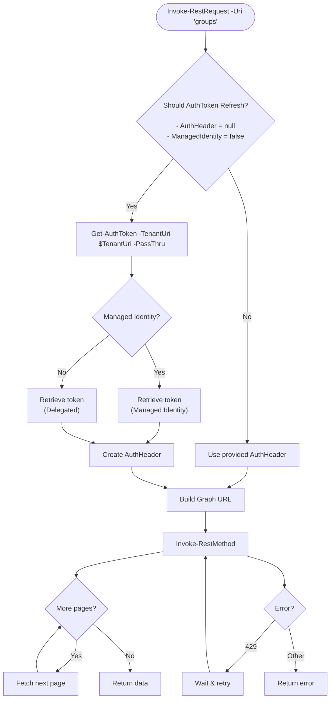

# Table of Contents

- [Table of Contents](#table-of-contents)
  - [What you'll learn](#what-youll-learn)
  - [Introduction](#introduction)
  - [Building the function](#building-the-function)
    - [Parameters](#parameters)
    - [Get-AuthToken](#get-authtoken)
    - [Building the URI and setting up for a call to Graph](#building-the-uri-and-setting-up-for-a-call-to-graph)
    - [Paging](#paging)
    - [Error handling](#error-handling)
    - [Response 429, Too many requests](#response-429-too-many-requests)
  - [Full function](#full-function)
  - [High level flowchart](#high-level-flowchart)
  - [Conclusion](#conclusion)

## What you'll learn

The second part of the Graph series will walk you through the wrapper for actually requesting data from the Graph API. You'll learn how to automatically extract error codes, do automatic paging and handle the 429 (Too many requests) return code.  

## Introduction
This function was actually created before the authentication function, but has evolved over time. The main focus, though, has always been on making it easy to use. Not just in the sense of not having to construct variables and objects for the actual call, but a newcomer to the company or to the Graph API should not have to be thinking about all this other stuff like constructing headers, content types or building URIs throughout the whole script.  
Most of the stuff that you generally want to do with the Graph API is already automatically built into this function, which makes a simple group get request go from this:

```powershell
$BaseURI = "https://graph.microsoft.com/"
$Version = "v1.0"
$Endpoint = "/groups"
$Uri = "$BaseUri$Version$Endpoint"

#Code for retrieving the token

$Header = @{
    Authorization = $Token
    # Other values ?
}
Invoke-RestMethod -Uri $Uri -Method Get -Headers $Header
```
or a potentially extremely long oneliner, to this:

```powershell
Invoke-RestRequest -Uri Groups
```

What I figured as I was doing the first method a lot was that I was doing redundant work, and it annoyed me enough to create this wrapper function.

## Building the function

### Parameters

So how do we get started with this function, we need to add parameters for all the stuff that we want to be able to do or automate. Since it's a wrapper for Invoke-RestMethod we need to build in parameters for the most used parameters for Invoke-RestMethod. While setting the parameters, we are also defaulting some of them for easier use of the wrapper. For example most of the calls you make to Graph are probably through the Get method, so we should default the Method parameter to Get. When we want to make a Post or Delete, we specify that by overriding the default value of the param by explicitly setting the parameter value in the call.

```powershell
function Invoke-RestRequest {
    [CmdletBinding()]
    param (
        [Parameter(Mandatory = $true)]
        [string]$Uri,

        [Parameter(Mandatory = $false)]
        [ValidateSet('Default', 'Delete', 'Get', 'Head', 'Merge', 'Options', 'Patch', 'Post', 'Put', 'Trace')]
        [string]$Method = 'Get',

        [Parameter(Mandatory = $false)]
        $Body,

        [Parameter(Mandatory = $false)]
        [ValidateSet('Beta','v1.0')]
        $Version = 'Beta',

        [Parameter(Mandatory = $false)]
        $AuthHeader = $null,

        [Parameter(Mandatory = $false)]
        [string]$TenantUri = $script:Tenant,

        [Parameter(Mandatory = $false)]
        [string]$ContentType = 'application/json; charset=utf-8'
    )
}
```
### Get-AuthToken
Next step of the function will hook into the Get-AuthToken function we talked about in part 1. The hook will basically check for a token, if none exists it should create one and save it to the module scope, if a token exists in the module scope, we want to use that.

```powershell
# If no other AuthToken was provided, refresh existing graph tokens
$ShouldRefresh = [bool](($script:ManagedIdentitySwitch -eq $false -or [string]::IsNullOrEmpty($script:ManagedIdentitySwitch)) -and ($null -eq $AuthHeader))
if ($ShouldRefresh -eq $true) {
    $AuthHeader = Get-AuthToken -TenantUri $TenantUri -PassThru
}
```
We check that the **ManagedIdentitySwitch** variable is either false or null/empty, and that the **AuthHeader** variable is empty. If these conditions are met we should call the function `Get-AuthToken` with the provided `$TenantUri` and the **PassThru** parameter. When doing it this way we basically don't have to manually authenticate to the tenant, we are free to make the Graph API call directly, if already authenticated everything is fine, if not, everything *will* be fine!  
As we learned in the previous blog post:
- If the **TenantUri** parameter is empty, the user will be prompted to enter the tenant manually. 
- The **ManagedIdentitySwitch** parameter switch is used manually when authenticating in an Azure Function.

### Building the URI and setting up for a call to Graph

Next we build the URI for the graph base URL and version, then create the splatting variable to use when calling Invoke-RestMethod. This is done in a try/catch statement to be able to handle errors in a better way. The Body is also configured and set in this statement, adding the correct ContentType parameter to the splatting variable if a Body is provided to the function.  

I decided to add the option to omit the first forward slash in the url, that way you could use either `Invoke-RestRequest -Uri "/groups"` or `Invoke-RestRequest -Uri "groups"`. In this part we also handle the paging.  

> Splatting is a nicely formatted hashtable with parameters and their values which you can use instead of long function calls.  
> To use splatting, create a hashtable with key/value pairs of and save it to a variable, for example "Parameters", then call the function like this `Invoke-RestMethod @Parameters`. See the next code block for an example.

### Paging

When calling the Graph API it usually only returns 100 results at a time. To retrieve more results you have to "page".  
- The Graph API response includes an @odata.nextlink property  
- The value of this property is a link to the next "page" of results
- We can automatically loop and recursively call our function until @odata.nextlink doesn't exist anymore
- Each loop will add the result back to the `$ResponseBody` variable  
  

> As a sidenote, I'm usually on a small tenant with a couple of hundred devices, where automatic paging is fine.  
> Since each call might take upwards of a second, the larger the tenant the longer the call is going to take, getting all groups in our large tenant with over 12000 groups can take over 10 minutes.
> Therefore, if you're on a larger tenant you should probably add a switch parameter where you enable/disable automatic paging, and focus on filtering early instead.  


```powershell
if ($Uri -notlike '/*') {
    $Uri = "/$Uri"
}
$GraphVersion = "https://graph.microsoft.com/$version"

try {
    $RestParameters = @{
        Uri         = "$GraphVersion$Uri"
        Method      = $Method
        Headers     = $AuthHeader
        ErrorAction = 'Stop'
    }

    if ($Body) {
        $RestParameters['Body'] = $Body
        $RestParameters['ContentType'] = $ContentType
    }

    $ResponseBody = Invoke-RestMethod @RestParameters

    if ($ResponseBody.'@odata.nextlink') {
        $NextLink = $ResponseBody.'@odata.nextlink'
        while ($null -ne $NextLink) {
            $NextPage = Invoke-RestMethod -Uri "$NextLink" -Method $Method -Headers $authHeader -ErrorAction Stop
            $NextLink = $NextPage.'@odata.nextlink'
            $ResponseBody.Value += $NextPage.Value
        }
    }
}
```
### Error handling

When things go wrong, we need to properly display good information to the user. You are probably the one that will need to fix the problem if you've shared the module someone else, so the better the error information the less time you have to spend in the debugger!  
Usually Graph returns error details deeply nested into the response, I try to format this nicely and output only what is necessary to quickly figure out what's wrong. I also send the whole errorobject to the global scoped variable `$ResponseError`.  
> You are not supposed to use global scoped variables but this way we can retrieve the full error if needed even if the script has exited but the PowerShell session is still running.
> This might save you time in the debugger or riddling your code with `Write-Host`.

So a custom error object is created and returned, since the **FullError** is large and mostly unnecessary I want to hide it from the user by default but still make it possible to dig out by accessing the property with dot notation, for example `$Response.FullError`.  
> You can hide properties in pscustomobjects with `PSPropertySet`, `PSMemberInfo` and `PSStandardMembers`

```powershell
catch {
$ErrorObject = [System.Collections.Generic.List[object]]::new()
$ResponseCode = $_.Exception.Message -replace '\D', ''
$ResponseErrorMessage = $null

try {
    $ResponseErrorDetailsMessage = ($_.ErrorDetails.message -replace '\\u0027', "'" | Out-String).Trim()
    $ResponseErrorMessage = ($ResponseErrorDetailsMessage | ConvertFrom-Json).error.message
} catch {
    Write-Verbose 'Failed to parse error details.'
}
$Properties = [ordered]@{
    'Exception'            = $_.Exception.Message
    'ResponseCode'         = $ResponseCode
    'ResponseErrorCode'    = $_.Exception.StatusCode
    'ResponseErrorMessage' = $ResponseErrorMessage
    'FullError'            = $_
}
$ErrorObject.Add((New-Object -TypeName psobject -Property $Properties))
#region Hiding FullError property
$DefaultProperties = @(
    'ResponseErrorCode'
    'ResponseCode'
    'Exception'
    'ResponseErrorMessage'
)
$DefaultDisplayPropertySet = New-Object System.Management.Automation.PSPropertySet(
    'DefaultDisplayPropertySet',
    [string[]]$defaultProperties
)
$PSStandardMembers = [System.Management.Automation.PSMemberInfo[]]@($defaultDisplayPropertySet)
$ErrorObject | Add-Member -MemberType MemberSet PSStandardMembers -Value $PSStandardMembers
#endregion
```

### Response 429, Too many requests

The next piece is a little more fun, it handles the annoying response code **429**, aka "Too many requests".  
- If you hammer the Graph API, it should respond with a response code of **429** and a **RetryAfter** property 
  - The RetryAfter property contains the amount of time to wait before you do your next call
- We check if the custom created variable `$ResponseCode` is **429** and look for the RetryAfter property
  - Lately, the RetryAfter property doesn't always exist or have a null value
  - To solve, we try to parse the RetryAfter property with the [TimeStamp] class, if it fails we default to 10 seconds.
- Pause the script execution for the `$RetryAfter` amount of seconds
- Recursively call the Invoke-RestRequest function again with the same parameters

```powershell
# Segment to handle Too many requests error message
if ($ResponseCode -eq '429') {
    $RetryAfter = 10
    try {
        $RetryAfter = [TimeSpan]::Parse(($ErrorObject.ResponseErrorMessage | ConvertFrom-Json).RetryAfter).TotalSeconds + 5
    } catch {
        Write-Verbose "Failed to retrieve RetryAfter, defaulting to $RetryAfter seconds..."
    }
    Write-Host "Too many requests, retrying in $RetryAfter seconds..." -ForegroundColor Yellow
    Start-Sleep -Seconds $RetryAfter
    if ($Body) {
        $ResponseBody = Invoke-RestRequest -Uri $Uri -Method $Method -Body $Body -Version $version -AuthHeader $RestParameters.Headers
    } else {
        $ResponseBody = Invoke-RestRequest -Uri $Uri -Method $Method -Version $Version -AuthHeader $RestParameters.Headers
    }
    return $ResponseBody
}

Write-Host 'Something went wrong:' -ForegroundColor Red
$ErrorObject | Out-Host
$global:ResponseError = $ErrorObject
# Void to avoid linter error message
[void]$ResponseError
return
}
```

After the last catch block we need to return the correct `$ResponseBody`. This completes this function!  

## Full function
```powershell
function Invoke-RestRequest {
    [CmdletBinding()]
    param (
        [Parameter(Mandatory = $true)]
        [string]$Uri,

        [Parameter(Mandatory = $false)]
        [ValidateSet('Default', 'Delete', 'Get', 'Head', 'Merge', 'Options', 'Patch', 'Post', 'Put', 'Trace')]
        [string]$Method = 'Get',

        [Parameter(Mandatory = $false)]
        $Body,

        [Parameter(Mandatory = $false)]
        [ValidateSet('Beta','v1.0')]
        $Version = 'Beta',

        [Parameter(Mandatory = $false)]
        $AuthHeader = $null,

        [Parameter(Mandatory = $false)]
        [string]$TenantUri = $script:Tenant,

        [Parameter(Mandatory = $false)]
        [string]$ContentType = 'application/json; charset=utf-8'
    )

    # If no other AuthToken was provided, refresh existing graph tokens
    $ShouldRefresh = [bool](($script:ManagedIdentitySwitch -eq $false -or [string]::IsNullOrEmpty($script:ManagedIdentitySwitch)) -and ($null -eq $AuthHeader))
    if ($ShouldRefresh -eq $true) {
        $AuthHeader = Get-AuthToken -TenantUri $TenantUri -PassThru
    }

    # Check if URI starts with /
    if ($Uri -notlike '/*') {
        $Uri = "/$Uri"
    }
    $GraphVersion = "https://graph.microsoft.com/$version"

    try {
        $RestParameters = @{
            Uri         = "$GraphVersion$Uri"
            Method      = $Method
            Headers     = $AuthHeader
            ErrorAction = 'Stop'
        }

        if ($Body) {
            $RestParameters['Body'] = $Body
            $RestParameters['ContentType'] = $ContentType
        }

        $ResponseBody = Invoke-RestMethod @RestParameters

        if ($ResponseBody.'@odata.nextlink') {
            $NextLink = $ResponseBody.'@odata.nextlink'
            while ($null -ne $NextLink) {
                $NextPage = Invoke-RestMethod -Uri "$NextLink" -Method $Method -Headers $authHeader -ErrorAction Stop
                $NextLink = $NextPage.'@odata.nextlink'
                $ResponseBody.Value += $NextPage.Value
            }
        }
    } catch {
        $ErrorObject = [System.Collections.Generic.List[object]]::new()
        $ResponseCode = $_.Exception.Message -replace '\D', ''
        $ResponseErrorMessage = $null

        try {
            $ResponseErrorDetailsMessage = ($_.ErrorDetails.message -replace '\\u0027', "'" | Out-String).Trim()
            $ResponseErrorMessage = ($ResponseErrorDetailsMessage | ConvertFrom-Json).error.message
        } catch {
            Write-Verbose 'Failed to parse error details.'
        }
        $Properties = [ordered]@{
            'Exception'            = $_.Exception.Message
            'ResponseCode'         = $ResponseCode
            'ResponseErrorCode'    = $_.Exception.StatusCode
            'ResponseErrorMessage' = $ResponseErrorMessage
            'FullError'            = $_
        }
        $ErrorObject.Add((New-Object -TypeName psobject -Property $Properties))
        #region Hiding FullError property
        $DefaultProperties = @(
            'ResponseErrorCode'
            'ResponseCode'
            'Exception'
            'ResponseErrorMessage'
        )
        $DefaultDisplayPropertySet = New-Object System.Management.Automation.PSPropertySet(
            'DefaultDisplayPropertySet',
            [string[]]$defaultProperties
        )
        $PSStandardMembers = [System.Management.Automation.PSMemberInfo[]]@($defaultDisplayPropertySet)
        $ErrorObject | Add-Member -MemberType MemberSet PSStandardMembers -Value $PSStandardMembers
        #endregion

        # Segment to handle Too many requests error message
        if ($ResponseCode -eq '429') {
            $RetryAfter = 10
            try {
                $RetryAfter = [TimeSpan]::Parse(($ErrorObject.ResponseErrorMessage | ConvertFrom-Json).RetryAfter).TotalSeconds + 5
            } catch {
                Write-Verbose "Failed to retrieve RetryAfter, defaulting to $RetryAfter seconds..."
            }
            Write-Host "Too many requests, retrying in $RetryAfter seconds..." -ForegroundColor Yellow
            Start-Sleep -Seconds $RetryAfter
            if ($Body) {
                $ResponseBody = Invoke-RestRequest -Uri $Uri -Method $Method -Body $Body -Version $version -AuthHeader $RestParameters.Headers
            } else {
                $ResponseBody = Invoke-RestRequest -Uri $Uri -Method $Method -Version $Version -AuthHeader $RestParameters.Headers
            }
            return $ResponseBody
        }

        Write-Host 'Something went wrong:' -ForegroundColor Red
        $ErrorObject | Out-Host
        $global:ResponseError = $ErrorObject
        # Void to avoid linter error message
        [void]$ResponseError
        return
    }
    return $ResponseBody
}
```

## High level flowchart



## Conclusion

We've now built a reusable wrapper around the `Invoke-RestMethod` function and hooked into our `Get-AuthToken` to make navigating through the Graph API much less painful!  
Instead of copy-pasting or rebuilding parameters you can simply:
- Call Graph with a single clean line: `Invoke-RestRequest -Uri groups`
- Automatically handle authentication headers and content types
- Page through large results with ease
- Get nicely formatted error objects back through the pipeline
- Let the function automatically handle those pesky 429/Too many requests responses

The functions `Get-AuthToken` and `Invoke-RestRequest` started as simple local functions in a couple of scripts to help me reduce the time needed to make Graph calls, but has since been converted into a fully fledged module and become a core part of all our Graph scripts today.